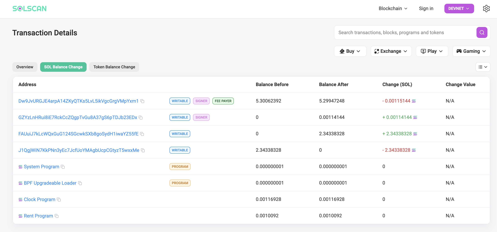
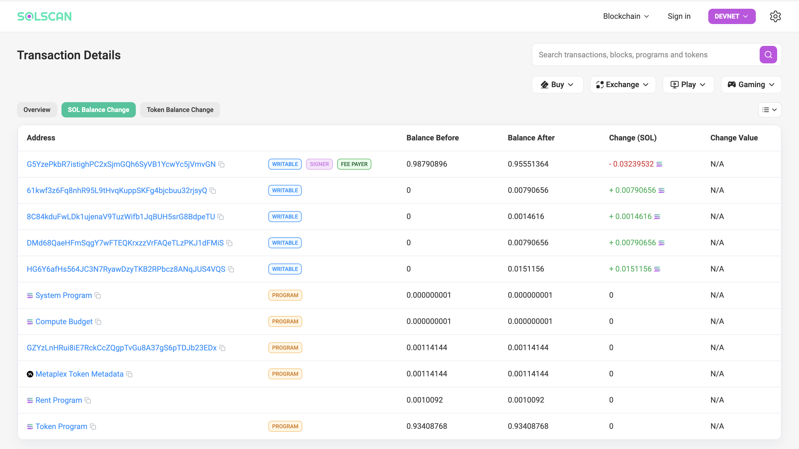
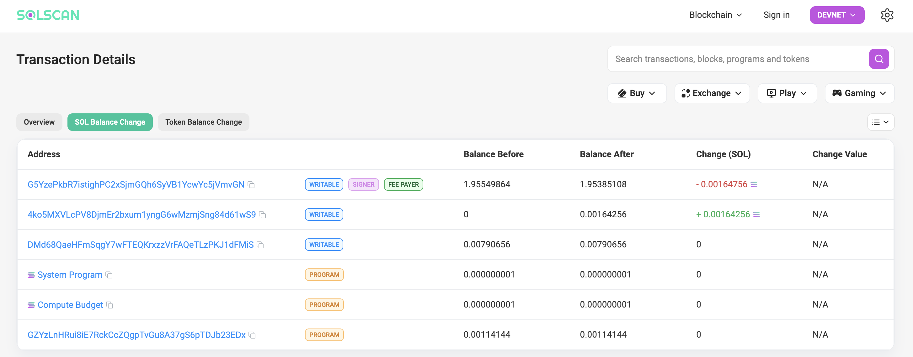
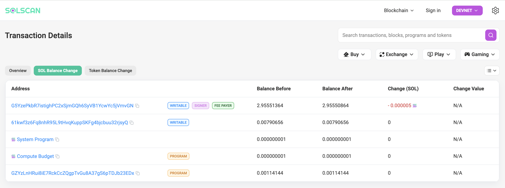
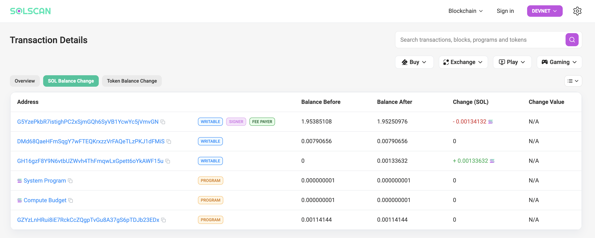
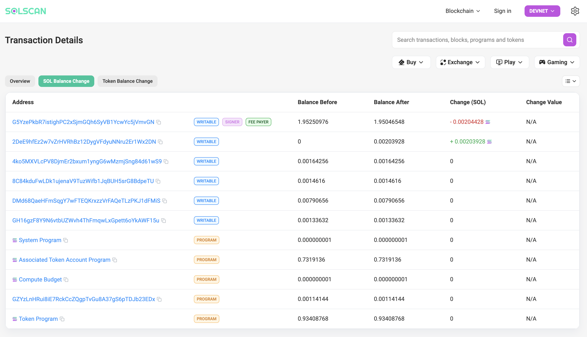
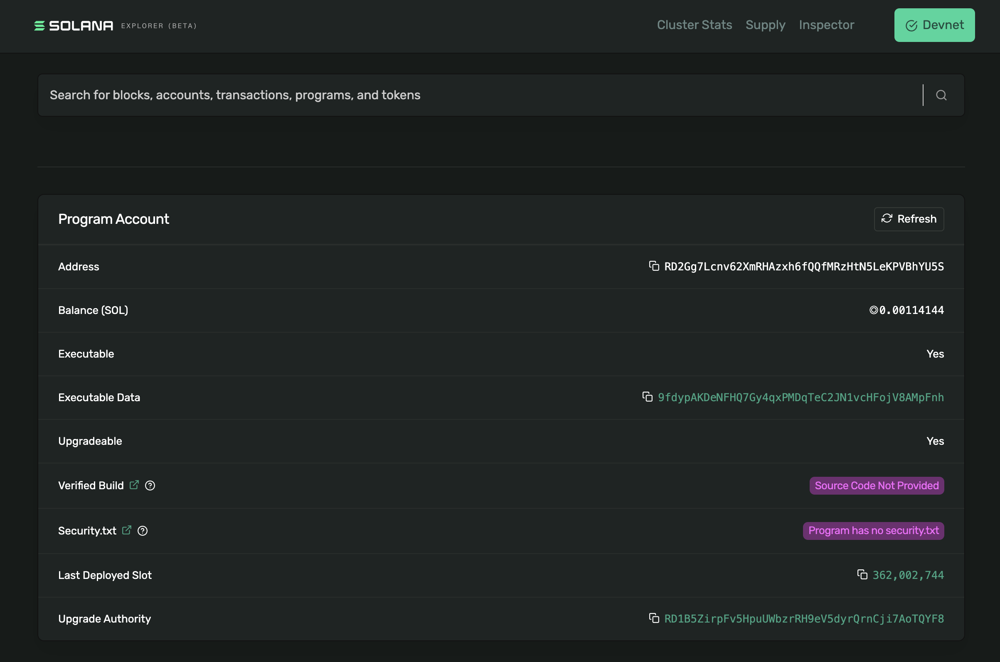

# 环境配置

* 完整测试的官方指引[https://solana.com/zh/developers/guides/advanced/testing-with-jest-and-bankrun](https://solana.com/zh/developers/guides/advanced/testing-with-jest-and-bankrun)

## 相关账号

* 新装好的系统，需要运行`solana-keygen new -o /root/.config/solana/id.json`创建账号，使用`solana address`来获取到公钥。

* hashlottery.fun服务器上账号的seed: `gadget document price region series friend trumpet twelve idea destroy angry spray`, 地址为`Dw9JvURGJE4arpA14ZKyQTKs5LvL5ikVgcGrgVMpYxm1`。

* Manager账号的seed:`crush taste violin best legal cruel sausage minute lady marine basket text`

* 将网络设置到Devnet,`solana config set --url https://api.devnet.solana.com`

* 使用`solana airdrop 2 Dw9JvURGJE4arpA14ZKyQTKs5LvL5ikVgcGrgVMpYxm1`来获取测试网的SOL

## 基本命令

* `anchor init {name}`之后，按照基本配置进行修改，再运行`anchor build`

* 使用`anchor test`进行测试，需要关闭VPN才能正常运行

## 费用计算

* deployment: 


* init:


* create:


* add:


* remove:


* record:


* approve:


## 测试网相关

* 测试网访问地址[https://explorer.solana.com/?cluster=devnet](https://explorer.solana.com/?cluster=devnet)

* Solscan [https://solscan.io/](https://solscan.io/)

### 切换的devnet

```Bash
    #设置成devnet
    solana config set --url https://api.devnet.solana.com

    #airdrop的功能
    solana airdrop 1 7yt5Dia64Mg5bZNfk3AU44Cdb4v93kaDRMZ9RXaSK9Lw
```

### 部署状况

* 部署的时候，保证有足够的SOL，不然中途断了会比较麻烦，使用`anchor deploy`进行部署，将使用`~/.config/solana/id.json`对应的账号来进行部署

* 必须`Executable`的，截图如下: 

## 基本配置

### 本地节点的运行

```Bash
    nohup solana-test-validator &

    #查找所有的运行线程
    ps aux | grep solana-test-validator

    #清除所有的进程
    pkill -f solana-test-validator
```

### 增加SPL的token的支持

执行以下命令

```Bash
    solana program dump metaqbxxUerdq28cj1RbAWkYQm3ybzjb6a8bt518x1s mpl_token_metadata.so
```

然后，在根目录下的Anchor.toml里添加以下内容

```TOML
    [[test.genesis]]
    address = "metaqbxxUerdq28cj1RbAWkYQm3ybzjb6a8bt518x1s"
    program = "mpl_token_metadata.so"
```

### 更多特性的支持

修改支持的细节，文件位置`ROOT/programs/luckysig/Cargo.toml`

```TOML
anchor-lang = { version = "0.30.1", features = ["init-if-needed"] }
anchor-spl = {version = "0.30.1", features = ["metadata"]}
```

### 梯子问题

* 使用QuickNode的服务来访问，绕开Solana的节点被屏蔽和缓慢的问题

### 逻辑过于复杂的处理

* 当合约方法逻辑过于复杂的时候，尤其是在使用`init-if-needed`特性的时候，好像是显著增加了计算需要的资源，合约能编译通过，但是会报`stack overflow`的错误，部署到devnet后是没法执行的。但使用`anchor test`是可以跑的